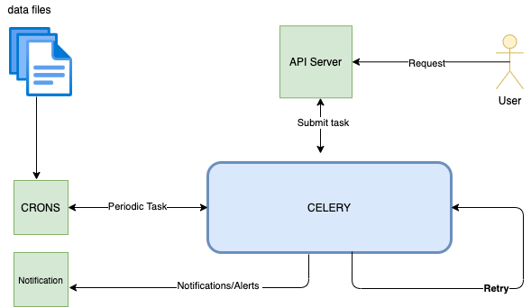

To start project use below command.

`docker-compose build`

`docker-compose up`

**Task 1**

Part 1

`curl "http://127.0.0.1:8000/rates?date_from=2016-01-01&date_to=2016-01-10&origin=CNSGH&destination=north_europe_main"`

`curl "http://127.0.0.1:8000/rates_null?date_from=2016-01-01&date_to=2016-01-10&origin=CNSGH&destination=north_europe_main"`

Part 2

With USD
`curl -H "Content-Type: application/json" -X POST --data '{"date_from":"2020-11-11", "date_to":"2020-11-12", "orig_code": "CNGGZ", "dest_code": "EETLL", "price": "123"}' http://127.0.0.1:8000/price`

With INR or any other currency

`curl -H "Content-Type: application/json" -X POST --data '{"date_from":"2020-11-21", "date_to":"2020-11-22", "orig_code": "CNGGZ", "dest_code": "EETLL", "price": "300"}' http://127.0.0.1:8000/price?currency=INR`

**Task 2**

High Level Design

As there can be multiple approach to solve this problem, I will try to solve this using Celery.
Celery is an asynchronous task queue based on distributed message passing. In above given design there are two ways to run a batch job-

1. Request can be submitted through api server that will submit the task in Celery.
2. We can Schedule Periodic tasks that can read data from data sources.

Things considered in design - 

1. Task should have retry facility if a task fails
2. Code should be idempotent in case of multiple attempt should not create duplicate records
3. Should alert if task failed or notify when success
4. Should have logging for debugging
5. Cost effective (Celery is opensource)
6. Try to create small data chunks batch so that it will be easy to maintain